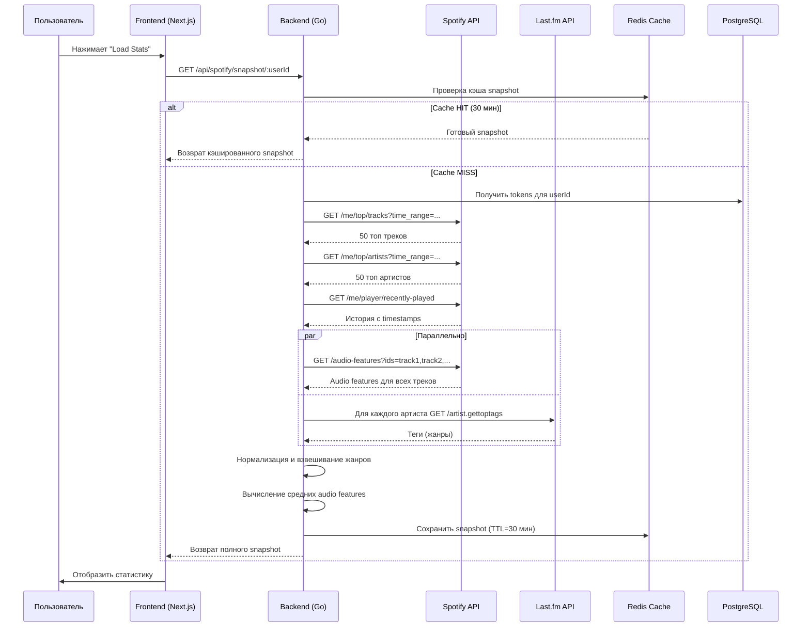

# sleepwalker.fm

**Дата**: 30 мая 2026  
**Статус**: ✅ Готов к локальному тестированию  
**Версия документации**: v1.0

## О проекте

### Назначение

sleepwalker.fm — это веб-приложение для полного анализа и визуализации Spotify статистики пользователя. Позволяет пользователям исследовать собственный музыкальный профиль через призму их истории прослушивания, топ треков, топ артистов, аудиохарактеристик и жанровых предпочтений.

### Решаемая проблема

Spotify предоставляет "Spotify Wrapped" один раз в год. sleepwalker.fm решает проблему ограниченности этого функционала:

- 📊 Позволяет анализировать статистику в **любой момент**, не только в конце года
- 🎯 Предоставляет **детальные метрики**: жанры, аудиохарактеристики, тренды прослушивания
- 🎼 Интегрирует **Last.fm для анализа жанров**, расширяя возможности Spotify жанровой таксономии
- 🔄 Кэширует данные для **быстрого доступа** с минимальной нагрузкой на Spotify API
- 🎵 Генерирует **персонализированные рекомендации** на основе музыкального профиля

### Основные сценарии использования

1. **Анализ музыкального профиля**: Просмотр топ артистов и треков за разные периоды (неделя, месяц, год, все время)
2. **Жанровая аналитика**: Определение основных жанров на основе Last.fm, анализ жанровых трендов
3. **Аудиоанализ**: Изучение средних аудиохарактеристик (энергичность, танцевальность, живость, вокальность)
4. **Персонализированные рекомендации**: Получение рекомендаций треков на основе собственного вкуса
5. **Экспорт плейлистов**: Сохранение рекомендаций в виде плейлиста на Spotify
6. **Comparative insights**: Сравнение музыкального вкуса между временными периодами

### Ключевые возможности

- ✅ OAuth 2.0 с PKCE для безопасной авторизации через Spotify
- ✅ Мультивременные интервалы анализа (short_term, medium_term, long_term)
- ✅ Интеграция с Last.fm для обогащения данных жанрами
- ✅ Умное кэширование с Redis (snapshot cache, artist metadata cache)
- ✅ Singleflight механизм для дедупликации одновременных запросов
- ✅ Rate limiting aware логика для соблюдения лимитов Spotify API
- ✅ Рекомендационный движок с двумя режимами (comfort, explore)
- ✅ Полная локализация на множество языков (i18n)
- ✅ Темная тема с Tailwind CSS + Radix UI компонентами
- ✅ Docker Compose для локальной разработки

---

## Архитектура системы

### Общая архитектура

```
┌──────────────────────────────────────────────────────────────────┐
│                         Browser (Frontend)                        │
│  ┌────────────────────────────────────────────────────────────┐  │
│  │  Next.js 15 + React 18 + TypeScript                        │  │
│  │  - Landing Page                                             │  │
│  │  - Protected Pages (Dashboard, Recommendations, Wrapped)    │  │
│  │  - Playlist Export                                          │  │
│  │  - Analytics & Stats                                        │  │
│  └────────────────────────────────────────────────────────────┘  │
└──────────────────────────────────────────────────────────────────┘
                              │ (HTTPS)
                              │
┌──────────────────────────────────────────────────────────────────┐
│                       ngrok Tunnel                                │
│                  (Development tunneling)                          │
└──────────────────────────────────────────────────────────────────┘
                              │
┌──────────────────────────────────────────────────────────────────┐
│                    Backend API (Go)                               │
│  ┌────────────────────────────────────────────────────────────┐  │
│  │         Gin HTTP Router & Middleware                       │  │
│  │  - CORS                                                     │  │
│  │  - Auth Guard                                              │  │
│  │  - Audit logging                                           │  │
│  ├────────────────────────────────────────────────────────────┤  │
│  │         OAuth Service Layer                                │  │
│  │  - PKCE OAuth flow handling                                │  │
│  │  - Token refresh logic                                     │  │
│  │  - State verification                                      │  │
│  ├────────────────────────────────────────────────────────────┤  │
│  │         Pipeline Service (Snapshot Aggregation)            │  │
│  │  - Fetch top tracks, artists, recently played              │  │
│  │  - Aggregate audio features                                │  │
│  │  - Enrich with Last.fm genres                              │  │
│  └────────────────────────────────────────────────────────────┘  │
│  ┌────────────────────────────────────────────────────────────┐  │
│  │         Data Access Layer (GORM)                           │  │
│  │  - OAuthStateRepo                                          │  │
│  │  - TokenRepo                                               │  │
│  │  - ArtistMetadataRepo                                      │  │
│  └────────────────────────────────────────────────────────────┘  │
└──────────────────────────────────────────────────────────────────┘
         │                │                    │
         ▼                ▼                    ▼
    PostgreSQL       Redis Cache        External APIs
    - oauth_state    - Snapshots        - Spotify API
    - tokens         - Metadata         - Last.fm API
    - artist_meta    - Features
```

### Frontend

#### Стек технологий

| Технология | Версия | Назначение |
|-----------|--------|-----------|
| **Next.js** | 15.1.6 | Framework для React приложений |
| **React** | 18.3.1 | UI компоненты и state management |
| **TypeScript** | 5.8.3 | Type-safe разработка |
| **Tailwind CSS** | 4.1.12 | Utility-first стилизация |
| **Zustand** | 4.4.0 | Lightweight state management |
| **Axios** | (в api.ts) | HTTP клиент |
| **Radix UI** | Latest | Headless UI компоненты |
| **Lucide React** | 0.487.0 | SVG иконки |
| **Recharts** | 2.15.2 | Графики и диаграммы |
| **React Hook Form** | 7.55.0 | Управление формами |
| **Framer Motion** | 11.11.11 | Анимации |
| **i18next** | 26.2.0 | Локализация |

#### Структура приложения

```
sleepwalker.fm.front/
├─ public/                      # Статические файлы
├─ src/
│  ├─ app/
│  │  ├─ layout.tsx             # Root layout с providers
│  │  ├─ page.tsx               # Landing page
│  │  ├─ globals.css            # Global styles
│  │  ├─ (protected)/           # Protected route group
│  │  │  ├─ layout.tsx          # Protected layout с auth guard
│  │  │  ├─ dashboard/
│  │  │  │  └─ page.tsx         # Dashboard (top artists, tracks)
│  │  │  ├─ recommendations/
│  │  │  │  └─ page.tsx         # Recommendations page
│  │  │  ├─ wrapped/
│  │  │  │  └─ page.tsx         # Wrapped insights (summary, timeline, compare)
│  │  │  └─ playlist/
│  │  │     └─ page.tsx         # Playlist export
│  │  ├─ auth/
│  │  │  └─ callback/
│  │  │     └─ page.tsx         # OAuth callback (legacy, redirects to /)
│  │  ├─ app/
│  │  │  └─ page.tsx            # Public app demo page
│  │  ├─ locales/               # i18n translations
│  │  ├─ services/              # Business logic (API calls)
│  │  └─ stores/                # Zustand state stores
│  ├─ components/
│  │  ├─ api-runtime-config.tsx # Runtime API config injection
│  │  ├─ app-shell.tsx          # App shell wrapper
│  │  ├─ auth-guard.tsx         # Auth protection HOC
│  │  ├─ info-banner.tsx        # Info/warning banners
│  │  ├─ playlist-export.tsx     # Playlist export component
│  │  ├─ token-refresh.tsx       # Token refresh logic
│  │  ├─ ui-state.tsx           # UI state management
│  │  ├─ providers/
│  │  │  └─ i18n-provider.tsx   # i18n context provider
│  │  └─ ui/                    # Radix UI + TW component library
│  ├─ hooks/
│  │  ├─ use-session.ts         # Session hook (user ID from localStorage)
│  │  └─ use-token-refresh.ts   # Token refresh interval hook
│  ├─ lib/
│  │  ├─ api.ts                 # API types и constants
│  │  ├─ api-base.ts            # API base URL resolver
│  │  ├─ messages.ts            # Message types
│  │  ├─ notices.ts             # Notice/warning helpers
│  │  └─ session.ts             # Session storage helpers
│  └─ styles/
│     ├─ globals.css
│     ├─ theme.css
│     ├─ tailwind.css
│     └─ fonts.css
├─ .env.example                 # Environment template
├─ next.config.ts              # Next.js configuration
├─ tsconfig.json               # TypeScript config
├─ tailwind.config.js          # Tailwind configuration
├─ postcss.config.mjs          # PostCSS config
└─ Dockerfile                  # Docker build
```

#### Основные страницы

| Страница | Путь | Описание | Защита |
|---------|------|---------|--------|
| **Landing** | `/` | Главная страница с кнопкой "Connect Spotify" | Нет |
| **Dashboard** | `/(protected)/dashboard` | Топ артисты и треки, жанры, статистика | ✅ Auth |
| **Recommendations** | `/(protected)/recommendations` | Персонализированные рекомендации | ✅ Auth |
| **Wrapped** | `/(protected)/wrapped` | Summary, Insights, Timeline, Compare | ✅ Auth |
| **Playlist** | `/(protected)/playlist` | Экспорт рекомендаций в Spotify | ✅ Auth |
| **Auth Callback** | `/auth/callback` | Legacy OAuth callback (redirects) | Нет |

#### Основные компоненты

- **AuthGuard**: HOC для защиты маршрутов, перенаправляет на `/` если нет session
- **TokenRefresh**: Периодическое обновление токена в фоне
- **I18nProvider**: Контекст для локализации на i18next
- **ApiRuntimeConfig**: Инъекция API URL в runtime (из env или localStorage)
- **PlaylistExport**: UI для экспорта плейлиста с контролем исключения треков
- **InfoBanner**: Компонент для отображения уведомлений и предупреждений

#### Работа с API

**API Base URL Resolution**:
```typescript
// Приоритет:
// 1. process.env.API_URL (runtime, от docker-compose)
// 2. process.env.NEXT_PUBLIC_API_URL (build time)
// 3. process.env.NEXT_PUBLIC_API_BASE_URL (fallback)
```

**API Client**:
- Использует `axios` через обертку в `lib/api.ts`
- Все endpoints:
  - `/auth/spotify/login` — инициирование OAuth
  - `/auth/session/:userId` — получение сессии
  - `/api/spotify/*` — данные из Spotify
  - `/api/wrapped/*` — Wrapped insights
  - `/api/stats/*` — аналитика
  - `/api/recommendations/*` — рекомендации

**Session Management**:
- User ID хранится в `localStorage` после успешного OAuth callback
- Hook `useSession()` читает localStorage
- Токены хранятся **только на backend** (refresh tokens не видны фронтенду)

### Backend

#### Стек технологий

| Технология | Версия | Назначение |
|-----------|--------|-----------|
| **Go** | 1.25.0 | Основной язык |
| **Gin** | 1.12.0 | HTTP framework |
| **GORM** | 1.26.0 | ORM для PostgreSQL |
| **PostgreSQL Driver** | 1.6.0 | Драйвер БД |
| **Redis** | 9.12.1 | In-memory cache |
| **golang.org/x/sync** | 0.20.0 | Singleflight для дедупликации |

#### Структура модулей

```
internal/
├─ main.go                           # Точка входа, инициализация сервисов
├─ config/
│  └─ config.go                     # Загрузка переменных окружения
├─ domain/
│  └─ models.go                     # Доменные сущности (SpotifyTokens, OAuthState, etc)
├─ repository/
│  └─ postgres/
│     ├─ db.go                      # GORM инициализация
│     ├─ models.go                  # Модели БД (OAuthState, SpotifyToken, ArtistMetadata)
│     ├─ oauth_state_repo.go        # OAuthStateRepo (Create, GetAndDelete)
│     ├─ token_repo.go              # TokenRepo (UpsertTokens, GetByUserID)
│     ├─ artist_metadata_repo.go    # ArtistMetadataRepo (GetByID, Upsert)
│     └─ migrations/
│        └─ 001_create_tables.sql   # SQL миграция
├─ service/
│  ├─ auth/
│  │  └─ auth.go                    # AuthService (Login, Callback, Session)
│  ├─ token/
│  │  └─ token.go                   # TokenService (EnsureFresh, Refresh)
│  ├─ spotify/
│  │  ├─ oauth_service.go           # OAuthService (PKCE flow, token exchange)
│  │  └─ api.go                     # APIService (authenticated requests to Spotify)
│  ├─ lastfm/
│  │  ├─ client.go                  # LastfmClient (HTTP клиент к Last.fm API)
│  │  └─ service.go                 # LastfmService (ArtistTags, AggregateGenres)
│  ├─ pipeline/
│  │  └─ pipeline.go                # Pipeline (Fetch & aggregate snapshot)
│  ├─ recommendation/
│  │  └─ recommendation.go          # RecommendationService (Generate recommendations)
│  └─ analytics/
│     └─ analytics.go               # AnalyticsService (вспомогательные функции)
└─ transport/
   └─ http/
      ├─ router.go                 # Gin router с всеми routes
      ├─ cors.go                   # CORS middleware
      ├─ audit.go                  # Audit logging middleware
      └─ handlers/
         ├─ oauth_handler.go       # OAuthHandler (Login, Callback, Refresh, Session)
         ├─ health.go              # HealthHandler (GET /health)
         ├─ spotify_api_handler.go  # SpotifyAPIHandler (все API endpoints)
         ├─ spotify_app_token.go    # App token fallback endpoints
         ├─ cache.go               # Cache helper functions
         ├─ notices.go             # Notice/warning management
         └─ recommendations_helpers.go # Recommendation building helpers
```

#### Основные сервисы

**OAuthService** (`spotify/oauth_service.go`)
- `StartLogin()`: генерирует state + verifier, возвращает authorize URL
- `HandleCallback()`: обменивает code на tokens, сохраняет в БД
- `RefreshAccessToken()`: обновляет access token по refresh token

**TokenService** (`token/token.go`)
- `EnsureFresh()`: получает токен, проактивно обновляет если близко к истечению (RefreshBuffer = 5 мин)
- `GetAccessToken()`: возвращает валидный access token
- `RefreshAfterUnauthorized()`: форсирует обновление после 401

**APIService** (`spotify/api.go`)
- `DoGET()`: выполняет GET запрос к Spotify с кэшированием, дедупликацией, rate limiting
- `doSharedGET()`: реализует singleflight для дедупликации одновременных запросов
- Состояния: OK, DEGRADED, BLOCKED (для rate limiting)
- Cache descriptors: fresh TTL vs stale TTL

**Pipeline** (`pipeline/pipeline.go`)
- `FetchSnapshot()`: получает topTracks, topArtists, recentlyPlayed и кэширует в Redis
- `buildSnapshot()`: вызывает fetchTopTracks, fetchTopArtists, fetchAudioFeatures, fetchRecentlyPlayed
- Cache key: `snapshot:{userId}:{timeRange}`
- TTL: 30 minutes

**RecommendationService** (`recommendation/recommendation.go`)
- `RecommendFromSnapshot()`: генерирует рекомендации на основе snapshot
- Использует Last.fm для жанров (если доступно)
- Fallback: Spotify artist genres → default genres
- Режимы: "comfort" (знакомая музыка), "explore" (новые исполнители)

**LastfmService** (`lastfm/service.go`)
- `ArtistTags()`: получает для артиста топ теги из Last.fm
- `AggregateArtistGenres()`: конкурентно собирает теги от нескольких артистов
- Нормализация тегов (hip-hop → hip hop, r&b → rnb)
- Взвешивание по частоте появления

#### Обработчики (Handlers)

**OAuthHandler** (`oauth_handler.go`)
- `Login()`: GET /auth/spotify/login → StartLogin() → redirect to Spotify
- `Callback()`: GET /auth/spotify/callback?code=X&state=Y → обмен токена → redirect to frontend
- `Refresh()`: POST /auth/refresh/:userId → refresh token
- `Session()`: GET /auth/session/:userId → текущая юзер сессия

**SpotifyAPIHandler** (`spotify_api_handler.go`)
- Получает snapshot, обогащает данные, возвращает в JSON

Endpoints:
- `GET /api/spotify/snapshot/:userId` — базовый snapshot
- `GET /api/spotify/top/artists/:userId` — только артисты
- `GET /api/spotify/top/tracks/:userId` — только треки
- `GET /api/spotify/recently-played/:userId` — недавно слушанное
- `GET /api/spotify/audio-features/:userId` — аудиохарактеристики

**Wrapped Endpoints**: (`spotify_api_handler.go`)
- `GET /api/wrapped/summary/:userId` — числовая статистика
- `GET /api/wrapped/insights/:userId` — текстовые insights
- `GET /api/wrapped/timeline/:userId` — тренды по часам/дням
- `GET /api/wrapped/compare/:userId` — сравнение периодов

**Stats Endpoints**: (`spotify_api_handler.go`)
- `GET /api/stats/profile/:userId` — средние характеристики
- `GET /api/stats/genres/:userId` — жанры
- `GET /api/stats/listening-time/:userId` — время прослушивания

**Recommendations**: (`spotify_api_handler.go`)
- `GET /api/recommendations/:userId` — получить рекомендации
- `POST /api/recommendations/playlist/:userId` — создать плейлист

### Интеграции

#### Spotify

**Использование**:

| Функция | Endpoint | Назначение |
|---------|----------|-----------|
| **Авторизация** | POST `/api/token` | PKCE OAuth token exchange |
| **Топ треки** | GET `/me/top/tracks` | 50 топ треков за period |
| **Топ артисты** | GET `/me/top/artists` | 50 топ артистов за period |
| **Recently Played** | GET `/me/player/recently-played` | История с timestamps |
| **Audio Features** | GET `/audio-features?ids=...` | Batch запрос (до 100 ID) |
| **User Profile** | GET `/me` | Данные пользователя |
| **Recommendations** | GET `/recommendations?seed_artists=...&seed_genres=...&seed_tracks=...` | Получить рекомендации |
| **Create Playlist** | POST `/users/{user_id}/playlists` | Создать плейлист |
| **Add Tracks** | POST `/playlists/{playlist_id}/tracks` | Добавить треки в плейлист |

**Scopes**:
```
user-read-email
user-read-private
user-top-read
user-read-recently-played
user-library-read
user-follow-read
playlist-read-private
playlist-modify-private
playlist-modify-public
```

**Auth Flow**: PKCE OAuth 2.0
- Frontend → redirect to `/auth/spotify/login`
- Backend → generate state + challenge → redirect to Spotify authorize
- Spotify → redirect to `/auth/spotify/callback?code=X&state=Y`
- Backend → exchange code for tokens → save to PostgreSQL → redirect to frontend

**Rate Limiting**:
- Global: 6 requests/sec
- Per-user: 1 request/sec
- Механизм: Redis-based sliding window
- Strategies:
  - Дедупликация (singleflight): одновременные запросы для одного ключа делятся результатом
  - Stale cache fallback: если rate limited, возвращаются старые данные
  - State management: OK, DEGRADED, BLOCKED

#### Last.fm

**Использование**, сугубо для **определения жанров**:

| Функция | Endpoint | Назначение |
|---------|----------|-----------|
| **Топ теги артиста** | GET `/artist.gettoptags` | 5-10 топ тегов (жанров) для артиста |
| **Похожие артисты** | GET `/artist.getsimilar` | (опционально) похожие артисты |

**Важное уточнение**:
- **Spotify** = источник пользовательских данных (топ артисты, треки, история, аудиофичи)
- **Last.fm** = источник жанров и тегов для обогащения данных

**Поток**:
1. Backend получает 50 топ артистов от Spotify
2. Backend запрашивает Last.fm для каждого артиста → получает теги
3. Нормализует теги (deduplicate variants)
4. Взвешивает по частоте
5. Возвращает top genres в snapshot

**Fallback**: Если Last.fm недоступен, используются Spotify artist.genres (встроенные жанры Spotify)

---

## Текущий Pipeline

Последовательность операций при загрузке статистики:



**Детали**:

1. **Авторизация**: Frontend передает userId в URL, Backend проверяет tokens в PostgreSQL
2. **Кэширование**: Snapshot кэшируется в Redis на 30 минут (`snapshot:{userId}:{timeRange}`)
3. **Дедупликация**: Одновременные запросы для одного ключа используют singleflight
4. **Rate Limiting**: Backend отслеживает rate limit Spotify, возвращает stale cache если лимит исчерпан
5. **Обогащение**: Spotify данные обогащаются Last.fm жанрами и аналитикой
6. **Fallback**:
   - Если Last.fm недоступен → используются Spotify artist.genres
   - Если Spotify rate limited → возвращаются stale данные
   - Если all fails → empty payload

---

## Система рекомендаций

### Текущая реализация

**Типы рекомендаций**:

| Режим | Описание | Источник данных |
|-------|---------|-----------------|
| **comfort** | Знакомая музыка, схожая с тем что слушал | Top artists, top tracks, top genres (Last.fm) |
| **explore** | Новые исполнители в похожих жанрах | Top genres (Last.fm), seed genres для Spotify recommendations API |

### Источники данных

1. **Top Artists** (от Spotify)
   - Берутся top 5 артистов
   - Используются как `seed_artists` для Spotify recommendations API

2. **Top Tracks** (от Spotify)
   - Берутся top 5 треков
   - Используются как `seed_tracks`

3. **Жанры** (от Last.fm или Spotify fallback)
   - Aggregated из Top Artists посредством Last.fm API
   - Берутся top 5 жанров
   - Используются как `seed_genres`

### Алгоритм

```
1. Получить snapshot (top artists, top tracks, recently played)
2. Извлечь seed seeds:
   - seed_artist_ids = top 5 artist IDs
   - seed_track_ids = top 5 track IDs
   - seed_genres = ?
     a) Если Last.fm доступен:
        - Для каждого top artist: Last.fm → top tags
        - Нормализовать теги (hip-hop → hip hop)
        - Взвесить по частоте
        - Выбрать top 5
     b) Иначе:
        - Использовать Spotify artist.genres
        - Если нет: default genres = ["pop", "rock"]

3. Вызвать Spotify Recommendations API:
   GET /recommendations?
     seed_artists=id1,id2,id3,id4,id5
     seed_genres=genre1,genre2,genre3,genre4,genre5
     seed_tracks=track_id1,track_id2,track_id3,track_id4,track_id5
     limit=50

4. Обогатить результаты:
   - Для comfort режима: match по genres
   - Для explore режима: highlight новые artists

5. Вернуть первые 20-50 рекомендаций с reasons
```

### Ограничения текущего алгоритма

1. ⚠️ **Зависимость от Last.fm**: Если Last.fm API недоступен, падает на Spotify artist.genres
2. ⚠️ **Максимум 5 seed items**: Spotify Recommendations API принимает max 5 seed_artists + 5 seed_tracks + 5 seed_genres (всего 5 из трех категорий)
3. ⚠️ **Отсутствие фильтрации**: Не исключаются треки, уже добавленные в плейлист
4. ⚠️ **Простой scoring**: Recommendations из Spotify берутся as-is, нет custom re-ranking

### Playlist Export

**Процесс**:

1. User нажимает "Create Playlist in Spotify"
2. Backend:
   a) Получает recommendations
   b) Вызывает POST `/users/{user_id}/playlists` → создает плейлист
   c) Вызывает POST `/playlists/{playlist_id}/tracks` → добавляет треки (батч по 100)
   d) При ошибке добавления трека → fallback к `spotify:track:ID` URI

3. Frontend:
   a) Отображает playlist link
   b) Пользователь может скопировать link или открыть в Spotify

**Ошибки при экспорте**:
- Если плейлист создан но треки не добавлены → возвращаются fallback_uris
- Если плейлист вообще не создан → возвращаются рекомендации как fallback_tracks

---

## Кэширование

### Стратегия кэширования

| Объект | Cache Key | Fresh TTL | Stale TTL | Хранилище | Механизм |
|--------|-----------|-----------|-----------|-----------|----------|
| **Snapshot** | `snapshot:{userId}:{timeRange}` | 30 мин | (no stale) | Redis | Redis SET/GET + singleflight |
| **Artist Metadata** | `artist_meta:{artistId}` | (not set) | (persistent) | PostgreSQL | GORM upsert |
| **Top Tags (Last.fm)** | `lastfm_artist_tags:{artistName}` | (no cache) | (no cache) | Memory | Inline fetch |
| **Spotify API responses** | `spotify_response:{endpoint}:{params}` | 1-24 hours (varies) | 7 days (soft) | Redis | APIService cache |
| **Token state** | `spotify_state:{userId}` | 5 мин | (soft) | Redis | OK, DEGRADED, BLOCKED |

### Snapshot Cache (30 мин)

**Key**: `snapshot:{userId}:{timeRange}` e.g. `snapshot:user123:medium_term`

**Структура**:
```json
{
  "user_id": "user123",
  "time_range": "medium_term",
  "top_tracks": [...],
  "top_artists": [...],
  "recently_played": [...],
  "audio_features": [...],
  "top_genres": [...],
  "seed_genres": [...],
  "seed_artists": [...],
  "seed_tracks": [...],
  "created_at": "2026-05-30T12:00:00Z"
}
```

**TTL**: 30 minutes

**Дедупликация**: singleflight group по cache key
- Если 5 одновременных запросов для одного ключа → 1 вычисление, 5 получают тот же результат

### Artist Metadata Cache (Persistent)

**Таблица**: `artist_metadata`

```sql
CREATE TABLE artist_metadata (
  artist_id TEXT PRIMARY KEY,
  genres_json TEXT,              -- Spotify genres
  inferred_genres_json TEXT,     -- Last.fm tags
  related_artists_json TEXT,     -- Для будущего использования
  source TEXT,                   -- "spotify", "lastfm", "combined"
  updated_at TIMESTAMPTZ
);
```

**Использование**: Можно сохранить Last.fm теги для артиста, чтобы не запрашивать Last.fm повторно

### API Cache (Spotify Requests)

**Кэширование в Redis** через `APIService.writeCache()`:

- **Fresh Cache**: Возвращается если существует
- **Stale Cache**: Fallback если rate limited или ошибка

**TTL зависит от endpoint**:
```go
const (
  spotifyDegradedTTL = 60 * time.Second  // Когда rate limited
  spotifyStateTTL    = 5 * time.Minute    // State OK/DEGRADED/BLOCKED
)
```

### Обновление кэша

**Автоматическое**:
- Snapshot: истекает через 30 мин
- API responses: истекает по TTL

**Ручное**:
- DELETE из Redis
- DELETE из PostgreSQL (для artist_metadata)

**Проактивное**:
- TokenService пересчитывает токены за 5 мин до истечения
- Snapshot пересчитывается при каждом новом запросе (если кэш истек)

---

## API

### Таблица endpoints

| Метод | Path | Назначение | Auth | Ответ |
|-------|------|-----------|------|--------|
| **GET** | `/health` | Health check | - | `{"status":"ok"}` |
| **GET** | `/auth/spotify/login` | Инициирование OAuth | - | Redirect to Spotify authorize |
| **GET** | `/auth/spotify/callback` | Обработка OAuth callback | - | Redirect to frontend + session |
| **POST** | `/auth/refresh/:userId` | Refresh access token | - | `{"access_token":"...", "expires_at":"..."}` |
| **GET** | `/auth/session/:userId` | Получить сессию | - | `{"user_id":"...", "access_token":"..."}` |
| **GET** | `/api/spotify/snapshot/:userId` | Базовый snapshot | ✅ | `{"snapshot": {...}, "top_genres": [...]}` |
| **GET** | `/api/spotify/top/artists/:userId` | Топ артисты | ✅ | `{"items": [artists], "total": N}` |
| **GET** | `/api/spotify/top/tracks/:userId` | Топ треки | ✅ | `{"items": [tracks], "total": N}` |
| **GET** | `/api/spotify/recently-played/:userId` | Recently played | ✅ | `{"items": [tracks+timestamps]}` |
| **GET** | `/api/spotify/audio-features/:userId` | Audio features | ✅ | `{"audio_features": [features]}` |
| **GET** | `/api/wrapped/summary/:userId` | Wrapped summary | ✅ | `{"time_range":"...", "top_artists":[...], ...}` |
| **GET** | `/api/wrapped/insights/:userId` | Wrapped insights | ✅ | `{"highlights":[...], "top_genre":"..."}` |
| **GET** | `/api/wrapped/timeline/:userId` | Wrapped timeline | ✅ | `{"by_day":[...], "by_hour":[...]}` |
| **GET** | `/api/wrapped/compare/:userId` | Compare periods | ✅ | `{"left_range":"...", "track_overlap":5, ...}` |
| **GET** | `/api/stats/profile/:userId` | Profile stats | ✅ | `{"avg_danceability":0.7, ...}` |
| **GET** | `/api/stats/genres/:userId` | Genre stats | ✅ | `{"genres":[{"genre":"pop", "count":15}, ...]}` |
| **GET** | `/api/stats/listening-time/:userId` | Listening time | ✅ | `{"by_hour":[...], "peak_hour":20}` |
| **GET** | `/api/recommendations/:userId` | Get recommendations | ✅ | `{"items":[...], "source":"lastfm_genre_engine", ...}` |
| **POST** | `/api/recommendations/playlist/:userId` | Create playlist | ✅ | `{"playlist_id":"...", "tracks_added":20}` |

### Примеры ответов

**GET /api/spotify/snapshot/:userId**
```json
{
  "snapshot": {
    "user_id": "user123",
    "time_range": "medium_term",
    "top_tracks": [
      {
        "id": "track_id",
        "name": "Song Name",
        "uri": "spotify:track:...",
        "duration_ms": 180000,
        "artists": [{"id": "artist_id", "name": "Artist"}]
      }
    ],
    "top_artists": [
      {
        "id": "artist_id",
        "name": "Artist",
        "popularity": 85,
        "genres": ["pop", "rock"],
        "images": [{"url": "..."}]
      }
    ],
    "recently_played": [
      {
        "track": {...},
        "played_at": "2026-05-30T10:30:00Z"
      }
    ],
    "audio_features": [
      {
        "id": "track_id",
        "danceability": 0.7,
        "energy": 0.8,
        "valence": 0.6,
        "tempo": 120
      }
    ],
    "top_genres": [
      {"genre": "pop", "count": 12, "weight": 0.3},
      {"genre": "rock", "count": 8, "weight": 0.2}
    ],
    "seed_genres": ["pop", "rock", "indie"],
    "seed_artist_ids": ["id1", "id2", "id3", "id4", "id5"],
    "seed_track_ids": ["track_id1", "track_id2"],
    "created_at": "2026-05-30T12:00:00Z"
  },
  "source": "snapshot_cache"
}
```

**GET /api/recommendations/:userId**
```json
{
  "mode": "comfort",
  "items": [
    {
      "track": {
        "id": "rec_track_1",
        "name": "Recommended Track",
        "uri": "spotify:track:...",
        "artists": [{"id": "artist_id", "name": "Artist"}]
      },
      "reason": "Similar to your top artist"
    }
  ],
  "source": "lastfm_genre_engine",
  "seed_track_ids": ["id1", "id2", "id3"],
  "seed_artist_ids": ["id1", "id2", "id3", "id4", "id5"],
  "seed_genres": ["pop", "rock", "indie"]
}
```

---

## База данных

### PostgreSQL Schema

**Таблица: oauth_state**
```sql
CREATE TABLE oauth_state (
  state TEXT PRIMARY KEY,
  code_verifier TEXT NOT NULL,      -- PKCE code verifier
  expires_at TIMESTAMPTZ NOT NULL,  -- Expires in 10 minutes
  created_at TIMESTAMPTZ NOT NULL
);
CREATE INDEX idx_oauth_state_expires_at ON oauth_state (expires_at);
```

**Назначение**: Временное хранилище state + verifier для PKCE OAuth flow. Удаляется после использования.

---

**Таблица: spotify_tokens**
```sql
CREATE TABLE spotify_tokens (
  user_id TEXT PRIMARY KEY,
  access_token TEXT NOT NULL,       -- Active access token
  refresh_token TEXT NOT NULL,      -- Refresh token (never sent to frontend)
  scope TEXT NOT NULL,              -- Authorized scopes
  token_type TEXT NOT NULL,         -- Usually "Bearer"
  expires_at TIMESTAMPTZ NOT NULL,  -- Access token expiry (usually 1 hour)
  updated_at TIMESTAMPTZ NOT NULL   -- Last update timestamp
);
```

**Назначение**: Основное хранилище для OAuth tokens пользователя. Ключ обновления tokens. Refresh tokens **никогда не отправляются на frontend**.

---

**Таблица: artist_metadata**
```sql
CREATE TABLE artist_metadata (
  artist_id TEXT PRIMARY KEY,
  genres_json TEXT NOT NULL DEFAULT '[]',          -- Spotify genres
  inferred_genres_json TEXT NOT NULL DEFAULT '[]', -- Last.fm tags (future)
  related_artists_json TEXT NOT NULL DEFAULT '[]', -- Related artists (future)
  source TEXT NOT NULL DEFAULT '',                 -- "spotify", "lastfm", "combined"
  updated_at TIMESTAMPTZ NOT NULL
);
CREATE INDEX idx_artist_metadata_updated_at ON artist_metadata (updated_at);
```

**Назначение**: Кэширование метаданных артистов (жанры, похожие артисты). Позволяет избежать повторных запросов к Spotify/Last.fm.

**Status**: ⚠️ Таблица зарезервирована на будущее, в текущей версии не заполняется активно.

### Связи между сущностями

```
┌─────────────────────────────────────────┐
│         User (Spotify User)             │
│  (Implicit - только user_id)            │
└──────────────┬──────────────────────────┘
               │
               │ user_id:1:*
               │
       ┌───────▼──────────┐
       │ spotify_tokens   │
       │ - user_id (PK)   │
       │ - access_token   │
       │ - refresh_token  │
       │ - expires_at     │
       └────────┬─────────┘
               │
               │ (via access_token)
               │
       ┌───────▼──────────────┐
       │  Spotify API         │
       │  - /me/top/artists   │
       │  - /me/top/tracks    │
       │  - /audio-features   │
       └───────┬──────────────┘
               │
               │ artist_id:1:*
               │
       ┌───────▼────────────────┐
       │ artist_metadata (opt)  │
       │ - artist_id (PK)       │
       │ - genres_json          │
       │ - source               │
       └────────────────────────┘

┌──────────────────────────────────────┐
│      oauth_state (temporary)        │
│ - state (PK)                         │
│ - code_verifier                      │
│ - expires_at (TTL: 10 min)          │
│                                      │
│ (Created during OAuth flow)          │
│ (Deleted after callback handled)     │
└──────────────────────────────────────┘
```

### Миграция

**Файл**: `internal/repository/postgres/migrations/001_create_tables.sql`

Миграция выполняется автоматически при запуске приложения через `GORM.AutoMigrate()`.

```go
if err := db.Gorm.AutoMigrate(
    &postgres.OAuthState{},
    &postgres.SpotifyToken{},
    &postgres.ArtistMetadata{},
); err != nil {
    log.Fatalf("db migration failed: %v", err)
}
```

---

## Технологический стек

### Frontend

| Слой | Технология | Версия | Роль |
|------|-----------|--------|------|
| **Framework** | Next.js | 15.1.6 | Server-side rendering, routing, API routes proxy |
| **React** | React | 18.3.1 | UI компоненты, hooks |
| **Язык** | TypeScript | 5.8.3 | Type-safe разработка |
| **Стилизация** | Tailwind CSS | 4.1.12 | Utility-first CSS framework |
| **Стилизация** | Radix UI | Latest | Headless компоненты (buttons, dialogs, tabs, etc) |
| **State** | Zustand | 4.4.0 | Lightweight state manager |
| **HTTP** | Axios | (in package.json) | HTTP клиент (обертка в lib/api.ts) |
| **Иконки** | Lucide React | 0.487.0 | SVG иконки |
| **Графики** | Recharts | 2.15.2 | React charting library |
| **Формы** | React Hook Form | 7.55.0 | Управление формами, валидация |
| **Анимации** | Framer Motion | 11.11.11 | Привлекательные анимации |
| **Локализация** | i18next | 26.2.0 | Multi-language support |
| **Дополнительно** | Sonner | 2.0.3 | Toast notifications |

### Backend

| Слой | Технология | Версия | Роль |
|------|-----------|--------|------|
| **Язык** | Go | 1.25.0 | Основной язык программирования |
| **HTTP Framework** | Gin | 1.12.0 | Lightweight web framework |
| **ORM** | GORM | 1.26.0 | ORM для работы с БД |
| **БД Driver** | PostgreSQL Driver | 1.6.0 | pgx driver для PostgreSQL |
| **СУБД** | PostgreSQL | 16 | Реляционная БД (в docker-compose) |
| **Cache** | Redis | 7.0 (alpine) | In-memory cache для snapshots, metadata |
| **Redis Driver** | go-redis | 9.12.1 | Redis клиент |
| **Concurrency** | golang.org/x/sync | 0.20.0 | singleflight для дедупликации |
| **Парсинг** | encoding/json | stdlib | JSON сериализация |
| **HTTP Client** | net/http | stdlib | HTTP клиент для Spotify/Last.fm |

### Infrastructure

| Компонент | Технология | Назначение |
|-----------|-----------|-----------|
| **Containerization** | Docker | Контейнеризация приложений |
| **Orchestration** | Docker Compose | Локальная оркестрация сервисов |
| **Tunneling** | ngrok | HTTPS туннель для локального тестирования |
| **OS** | Alpine Linux | Lightweight базовый образ |

### Архитектурные паттерны

- **Repository Pattern**: Отделение БД логики от бизнес-логики (postgres/)
- **Service Layer**: Бизнес-логика изолирована в service/*.go
- **Middleware**: CORS, audit logging, error handling в transport/http/
- **Dependency Injection**: Сервисы инъецируются в handlers через конструкторы
- **Factory Functions**: NewService(), NewHandler() как основной способ создания объектов

---

## Производительность

### Модель Snapshot

**Время вычисления** (без кэша):
- Fetch top tracks (50): ~500ms (1 API call)
- Fetch top artists (50): ~500ms (1 API call)
- Fetch recently played (50): ~500ms (1 API call)
- Fetch audio features (batch): ~300ms (1-2 API calls в зависимости от количества треков)
- Fetch Last.fm genres (concurrent, семафор=4): ~2-5 sec (50 artists × ~100ms per request)
- **Total**: ~4-7 секунд без кэша

**С кэшем**: <10ms (Redis get)

### Кэширование

**Snapshot cache** (30 min TTL):
- Снижает нагрузку на Spotify/Last.fm на 95%+ при частых запросах
- Singleflight дедупликация: одновременные запросы = 1 вычисление

**API cache**:
- Fresh cache: 1 час (настраивается в коде)
- Stale cache: 7 дней (fallback при rate limiting)

### Узкие места (Bottlenecks)

1. **Last.fm API**: Самый медленный компонент (2-5 sec для 50 артистов)
   - **Решение**: Параллельные запросы с семафором (max 4 одновременно)
   - **Потенциал**: Кэширование Last.fm результатов в artist_metadata table

2. **Spotify API Rate Limiting**:
   - Global: 6 requests/sec
   - Per-user: 1 request/sec
   - **Решение**: Singleflight дедупликация, stale cache fallback, rate limit aware logic

3. **PostgreSQL для artist_metadata**: В текущей версии редко используется
   - **Потенциал**: Использование для кэширования Last.fm результатов

4. **Frontend запросы**: Next.js может быть bottleneck при одновременных пользователях
   - **Решение**: ISR (Incremental Static Regeneration) для public pages

### Оптимизации

**Уже реализованные**:
- Singleflight для дедупликации одновременных запросов
- Redis cache с разумными TTL
- Параллельные запросы где возможно (Last.fm concurrent)
- Batch API calls (audio-features, playlist add)
- Stale cache fallback при rate limiting
- Token refresh ahead of time (RefreshBuffer = 5 min)

**Потенциальные оптимизации**:
- Кэширование Last.fm результатов в artist_metadata table
- Implementировать ISR/SSG для часто запрашиваемых pages
- Добавить GraphQL для более гибкого fetching
- Реализовать WebSocket для real-time обновлений
- Async background jobs для обогащения metadata

---

## Известные проблемы

### Текущие ограничения

1. **Last.fm зависимость**:
   - Last.fm может быть недоступен или медленный
   - Fallback на Spotify artist.genres работает, но менее точен
   - **Статус**: ⚠️ Не критично, но влияет на качество рекомендаций

2. **Spotify Seed Limits**:
   - Spotify recommendations требует max 5 seeds из трех категорий (artists, tracks, genres)
   - Сложно использовать больше информации для recommendations
   - **Статус**: ⚠️ Архитектурное ограничение Spotify API

3. **Отсутствие фильтрации в рекомендациях**:
   - Могут быть рекомендованы треки, уже добавленные в плейлист
   - Нет исключения по жанру, году выпуска и т.д.
   - **Статус**: ⚠️ Требует дополнительного ETL

4. **Audio Features для недавно выпущенных треков**:
   - Spotify может быть медленнее для совсем новых релизов
   - **Статус**: ✅ Редко встречается, обрабатывается gracefully

5. **PostgreSQL без индексов**:
   - artist_metadata может быть медленнее без индексов по genres
   - **Статус**: ✅ Не критично для текущего объема данных

6. **Frontend OAuth callback**:
   - OAuth callback обрабатывается на backend, frontend редирект может быть неточный
   - **Статус**: ✅ Обрабатывается редиректом на /

7. **Отсутствие refresh token rotation**:
   - Spotify refresh tokens не ротируются
   - **Статус**: ✅ Best practice, но не критично для MVP

8. **Нет user-specific limit tracking**:
   - Rate limiting отслеживается глобально, не по пользователю
   - **Статус**: ⚠️ Может привести к блокировке одного юзера влияющего на других

### Потенциальные регрессии

- 🔴 **Нет unit tests**: Изменения могут сломать функциональность без заметки
- 🔴 **Нет e2e tests**: Интеграция с Spotify может неожиданно сломаться
- 🟡 **Нет лога errors в production**: Сложно debugировать проблемы юзеров
- 🟡 **Нет monitoring**: Нет видимости когда Last.fm падает или замораживается

---

## Roadmap

### Высокий приоритет

#### 1. Улучшение качества рекомендаций
- [ ] Реализовать custom re-ranking алгоритм (по popularity, release date, audio features)
- [ ] Добавить фильтрацию (исключить уже слушанные, новые релизы, жанры)
- [ ] Выпустить на Spotify recommendations API и локально сравнить

#### 2. Monitoring & Observability
- [ ] Добавить структурированное логирование (JSON logs с полями)
- [ ] Интегрировать Sentry для tracking ошибок
- [ ] Добавить metrics (Prometheus) для rate limiting, cache hits, API latency
- [ ] Dashboards в Grafana

#### 3. Production hardening
- [ ] Добавить rate limiting per user (в зависимости от subscription)
- [ ] Refresh token rotation
- [ ] Sessions timeout и logout
- [ ] Admin panel для управления users/tokens

#### 4. Caching улучшения
- [ ] Кэшировать Last.fm результаты в artist_metadata table
- [ ] Async background job для обновления metadata
- [ ] Implement TTL lifecycle для stale entries

### Средний приоритет

#### 1. Персонализация
- [ ] User preferences (preferred genres, danceability range, year range)
- [ ] Сохранение preferences в БД
- [ ] Учет preferences при recommendation generation

#### 2. Аналитика
- [ ] Историческая аналитика (как менялись top artists по месяцам)
- [ ] Trend detection (rising artists, fading genres)
- [ ] Genre evolution timeline

#### 3. Social features
- [ ] Share snapshot ссылка
- [ ] Compare playlist с другими пользователями
- [ ] Leaderboards (most listened artists в регионе и т.д.)

#### 4. Export улучшения
- [ ] Export as CSV/JSON
- [ ] Export статистики в PDF report
- [ ] Sharing snapshot через соцсети

#### 5. UI/UX
- [ ] Dark mode improvements
- [ ] Mobile-first responsive design (текущий уже адекватный)
- [ ] Drag-n-drop для переупорядочивания плейлистов
- [ ] Keyboard shortcuts

### Низкий приоритет

#### 1. Backend масштабирование
- [ ] Horizontal scaling (multiple instances за load balancer)
- [ ] Database replicas (read replicas для analytics reads)
- [ ] Redis cluster для кэша

#### 2. Advanced ML
- [ ] Collaborative filtering (similar users)
- [ ] Time-series forecasting (predict next top artist)
- [ ] Mood-based recommendations

#### 3. Integration с другими платформенами
- [ ] Apple Music integration
- [ ] YouTube Music integration
- [ ] Deezer, TIDAL

#### 4. CI/CD
- [ ] GitHub Actions для automated tests
- [ ] Automatic deployments
- [ ] Staging environment
- [ ] Database migrations automation

#### 5. Testing
- [ ] Unit tests для service layer
- [ ] Integration tests с mock Spotify API
- [ ] e2e tests с Cypress/Playwright
- [ ] Load testing (k6, artillery)

---

## Структура проекта

```
sleepwalker.fm/
├─ README.md                            # Проект overview
├─ QUICKSTART.md                        # Быстрый старт (5 мин)
├─ TESTING.md                           # Полный пайплайн тестирования
├─ STATUS.md                            # Итоговый статус проекта
├─ WRAPPED_ENDPOINTS.md                 # Spotify API Analysis для Wrapped
├─ go.mod                               # Go dependencies
├─ go.sum                               # Go checksums
├─ Dockerfile                           # Backend Docker image
├─ docker-compose.yml                   # Development compose
├─ .env.example                         # Environment template
├─ .gitignore
├─ .dockerignore
│
├─ bin/
│  └─ app                              # Compiled binary (in .gitignore)
│
├─ docs/
│  ├─ PROJECT_STATUS.md                # Status updates
│  └─ PROJECT_DOCUMENTATION.md         # This file
│
├─ internal/
│  ├─ main.go                          # Entry point
│  │
│  ├─ config/
│  │  └─ config.go                     # Environment loading
│  │
│  ├─ domain/
│  │  └─ models.go                     # Domain entities
│  │
│  ├─ repository/
│  │  └─ postgres/
│  │     ├─ db.go                      # GORM setup
│  │     ├─ models.go                  # Database models
│  │     ├─ oauth_state_repo.go        # OAuth state repository
│  │     ├─ token_repo.go              # Token repository
│  │     ├─ artist_metadata_repo.go    # Artist metadata repository
│  │     └─ migrations/
│  │        └─ 001_create_tables.sql   # Database schema
│  │
│  ├─ service/
│  │  ├─ auth/
│  │  │  └─ auth.go                    # Authentication service
│  │  ├─ token/
│  │  │  └─ token.go                   # Token management service
│  │  ├─ spotify/
│  │  │  ├─ oauth_service.go           # Spotify OAuth PKCE flow
│  │  │  └─ api.go                     # Spotify API client
│  │  ├─ lastfm/
│  │  │  ├─ client.go                  # Last.fm API client
│  │  │  └─ service.go                 # Last.fm genre service
│  │  ├─ pipeline/
│  │  │  └─ pipeline.go                # Data pipeline (aggregate snapshot)
│  │  ├─ recommendation/
│  │  │  └─ recommendation.go          # Recommendation engine
│  │  ├─ analytics/
│  │  │  └─ analytics.go               # Analytics helpers
│  │
│  └─ transport/
│     └─ http/
│        ├─ router.go                  # Gin router definition
│        ├─ cors.go                    # CORS middleware
│        ├─ audit.go                   # Audit logging middleware
│        └─ handlers/
│           ├─ oauth_handler.go        # OAuth endpoints
│           ├─ health.go               # Health check
│           ├─ spotify_api_handler.go   # Spotify API endpoints
│           ├─ spotify_app_token.go     # App token fallback
│           ├─ cache.go                # Cache helpers
│           ├─ notices.go              # Notice management
│           └─ recommendations_helpers.go # Recommendation builders
│
├─ watch-ngrok.sh                      # Auto-update ngrok URL script
├─ diagnostic-spotify-api.sh           # Spotify API diagnostic
├─ get-user-id.sh                      # Extract user ID from refresh token
├─ test-top-artists.sh                 # Test top authors endpoint
│
└─ sleepwalker.fm.front/               # Frontend (Next.js)
   ├─ README.md
   ├─ package.json                     # Dependencies
   ├─ pnpm-lock.yaml                   # Locked versions
   ├─ pnpm-workspace.yaml
   ├─ next.config.ts
   ├─ tsconfig.json
   ├─ tsconfig.node.json
   ├─ tailwind.config.js
   ├─ postcss.config.mjs
   ├─ vite.config.ts
   ├─ Dockerfile
   ├─ index.html
   │
   ├─ public/                          # Static assets
   ├─ src/
   │  ├─ app/
   │  │  ├─ layout.tsx                 # Root layout
   │  │  ├─ page.tsx                   # Landing page
   │  │  ├─ globals.css                # Global styles
   │  │  ├─ (protected)/               # Protected route group
   │  │  │  ├─ layout.tsx              # Auth guard layout
   │  │  │  ├─ dashboard/page.tsx
   │  │  │  ├─ recommendations/page.tsx
   │  │  │  ├─ wrapped/page.tsx
   │  │  │  └─ playlist/page.tsx
   │  │  ├─ auth/callback/page.tsx
   │  │  ├─ app/page.tsx
   │  │  ├─ locales/                   # i18n files
   │  │  ├─ services/
   │  │  └─ stores/
   │  │
   │  ├─ components/
   │  │  ├─ api-runtime-config.tsx
   │  │  ├─ app-shell.tsx
   │  │  ├─ auth-guard.tsx
   │  │  ├─ info-banner.tsx
   │  │  ├─ playlist-export.tsx
   │  │  ├─ token-refresh.tsx
   │  │  ├─ ui-state.tsx
   │  │  ├─ providers/
   │  │  │  └─ i18n-provider.tsx
   │  │  └─ ui/                        # Radix UI component library
   │  │
   │  ├─ hooks/
   │  │  ├─ use-session.ts
   │  │  └─ use-token-refresh.ts
   │  │
   │  ├─ lib/
   │  │  ├─ api.ts                     # API types
   │  │  ├─ api-base.ts                # API base URL resolver
   │  │  ├─ messages.ts
   │  │  ├─ notices.ts
   │  │  └─ session.ts
   │  │
   │  └─ styles/
   │     ├─ globals.css
   │     ├─ theme.css
   │     ├─ tailwind.css
   │     └─ fonts.css
   │
   ├─ .eslintrc.json
   └─ vite-env.d.ts
```

### Назначение каждой директории

| Директория | Назначение |
|-----------|-----------|
| **internal/** | Весь server-side код (Go). Запрещен из других модулей. |
| **internal/config/** | Загрузка переменных окружения (.env) |
| **internal/domain/** | Доменные сущности (не зависят от инфраструктуры) |
| **internal/repository/** | Data access layer (GORM, queries) |
| **internal/service/** | Бизнес-логика (OAuth, pipeline, recommendations) |
| **internal/transport/http/** | HTTP layer (Gin routes, handlers, middleware) |
| **sleepwalker.fm.front/** | Весь client-side код (Next.js + React) |
| **sleepwalker.fm.front/src/app/** | Pages (routing, layouts) |
| **sleepwalker.fm.front/src/components/** | React components (UI, logic) |
| **sleepwalker.fm.front/src/lib/** | Utilities (API, session management) |
| **sleepwalker.fm.front/src/hooks/** | Custom React hooks |
| **docs/** | Документация проекта |

### Git structure

```
main (production ready)
 └─ Features branched from main
    ├─ feature/recommendations-v2
    ├─ feature/monitoring
    ├─ bugfix/rate-limiting
    └─ ...

.gitignore исключает:
 - bin/app (compiled binary)
 - .env (environment secrets)
 - .env.local (local overrides)
 - node_modules/
 - .next/
 - dist/
 - /sleepwalker.fm.front/node_modules/
```

---

## Итоговый контрольный список

### ✅ Функциональность

- [x] Spotify OAuth 2.0 с PKCE
- [x] Снимок статистики (snapshot)
- [x] Множественные временные интервалы
- [x] Интеграция Last.fm для жанров
- [x] Рекомендации на основе вкуса
- [x] Экспорт плейлиста
- [x] Аналитика (stats, wrapped)
- [x] Frontend + Backend + Database + Cache

### ⚠️ Missing (из requester'ов)

- [ ] Web-based playlist editor
- [ ] Export statistics as PDF
- [ ] Advanced filtering в рекомендациях
- [ ] User preferences persistence

### 🔧 Development

- [x] Docker Compose setup
- [x] Hot reload scripts (watch-ngrok.sh)
- [ ] Unit tests
- [ ] E2E tests
- [ ] CI/CD pipeline

### 📚 Documentation

- [x] README.md (overview)
- [x] QUICKSTART.md (5 мин старт)
- [x] TESTING.md (полный pipeline)
- [x] PROJECT_DOCUMENTATION.md (this file)
- [ ] API documentation (OpenAPI/Swagger)
- [ ] Architecture decision records (ADR)

---

**Документ составлен**: 30 мая 2026  
**Версия**: v1.0  
**Статус**: ✅ Актуально
